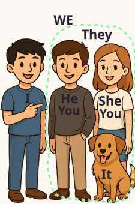
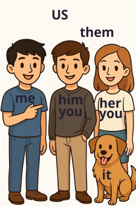
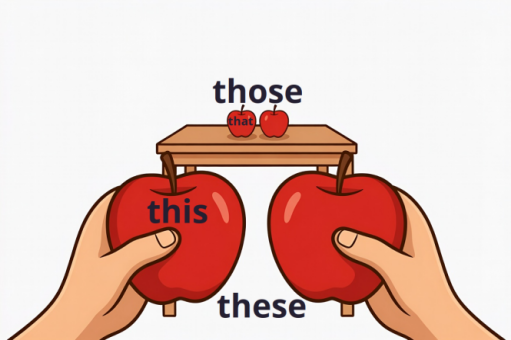

# Pronouns (Personal, Demonstrative)
**Personal pronouns (личные местоимения)** имеют два падежа — **именительный** и **косвенный**.

## Звук TH широко распространен в лексике, начиная с артикля the и местоимений...

**Звонкий звук ${\eth}$, требует участия голосовых связок.**
При произношении вибрирует гортань.


[Как произносить слово that, звук ð, th](https://www.youtube.com/shorts/uYBm4T9bWGI)

<video width="400" controls volume="0.3" class="quiet-loop">
  <source src="/sources/that.mp4" type="video/mp4">
</video>

[englishbad: Th](https://www.youtube.com/watch?v=w5ZhhGQrAwE)

<video width="400" controls volume="0.3" class="quiet-loop">
  <source src="/sources/englishbad_th.mp4" type="video/mp4">
</video>
 
Тренировка: слушать и повторять

* They gather. Those other. This brother. These mothers. That feather.

  <audio controls loop volume="0.3" class="quiet-loop">
    <source src="/sources/th_pronouns.mp3" type="audio/mpeg">
  </audio>

  <audio controls loop volume="0.3" class="quiet-loop">
    <source src="/sources/th_pronouns_tophonetics.mp3" type="audio/mpeg">
  </audio>

<details>
<summary> <b> Звонкий звук ${\eth}$ </b></summary>
 

Сочетания $[\eth]$ с другими звуками:

1. Звонкий $[\eth]$ + Гласные

Звук $[\eth]$ может сочетаться практически с любой гласной:
*   **С "a":** *than* $[\eth æn]$, *that* $[\eth æt]$, *father* $[ˈf\text{ɑː}\ethə(r)]$.

  ```
    Bigger than a house — больше, чем дом.
    More than usual — больше, чем обычно.
    Rather than waiting — вместо того чтобы ждать.
    Less than half — меньше половины.
  ```

  <audio controls loop volume="0.3" class="quiet-loop">
    <source src="/sources/than_google.mp3" type="audio/mpeg">
  </audio>

  <audio controls loop volume="0.3" class="quiet-loop">
    <source src="/sources/than_tophonetics.mp3" type="audio/mpeg">
  </audio>

  ```
    That is right for us. — Это правильно для нас / Это нам подходит.
    That one over there. — Вон тот (который находится далеко).
    Soon after that. — Вскоре после этого.
  ```

  <audio controls loop volume="0.3" class="quiet-loop">
    <source src="/sources/that_google.mp3" type="audio/mpeg">
  </audio>

  <audio controls loop volume="0.3" class="quiet-loop">
    <source src="/sources/that_tophonetics.mp3" type="audio/mpeg">
  </audio>
  
  ```
    One of the founding fathers... — Один из отцов-основателей (проекта, компании).
    Just like father, like son. — Прямо как отец и сын (в плане сходства привычек).
    He was a father figure to me. — Он был для меня как отец.
  ```

  <audio controls loop volume="0.3" class="quiet-loop">
    <source src="/sources/father_google.mp3" type="audio/mpeg">
  </audio>

  <audio controls loop volume="0.3" class="quiet-loop">
    <source src="/sources/father_tophonetics.mp3" type="audio/mpeg">
  </audio>


*   **С "e":** *the* $[\ethə]$, *them* $[\eth em]$, *then* $[\eth en]$, *weather* $[ˈwe\ethə(r)]$.

  ```
    At the moment, I’m busy. — В данный момент я занят.
    Take all of them. — Возьми их все.
    Since then, life has changed. — С тех пор жизнь изменилась.
    The weather is nice. — Погода хорошая.
  ```

  <audio controls loop volume="0.3" class="quiet-loop">
    <source src="/sources/them_google.mp3" type="audio/mpeg">
  </audio>

  <audio controls loop volume="0.3" class="quiet-loop">
    <source src="/sources/them_tophonetics.mp3" type="audio/mpeg">
  </audio>


*   **С "i":** *this* $[\eth\text{ɪ}s]$, *with* $[w\text{ɪ}\eth]$, *hither* (сюда — устар.).

  ```
  This way, please. — Сюда, пожалуйста.
  Come this way. — Идите этим путем / Проходите сюда.
  Go with me. — Пойдем со мной.
  ```

  <audio controls loop volume="0.3" class="quiet-loop">
    <source src="/sources/this_google.mp3" type="audio/mpeg">
  </audio>


  <audio controls loop volume="0.3" class="quiet-loop">
    <source src="/sources/this_tophonetics.mp3" type="audio/mpeg">
  </audio>


*   **С "o":** *those* $[\eth əʊz]$, *mother* $[ˈm\text{ʌ}\ethə(r)]$, *other* $[ˈ\text{ʌ}\ethə(r)]$.

  ```
  Those who know me... — Те, кто меня знают...
  Respect Mother Nature. — Уважайте мать-природу.
  Other people. — Другие люди.
  Some other time. — Как-нибудь в другой раз.
  ```
 
  <audio controls loop volume="0.3" class="quiet-loop">
    <source src="/sources/other_google.mp3" type="audio/mpeg">
  </audio>


  <audio controls loop volume="0.3" class="quiet-loop">
    <source src="/sources/other_tophonetics.mp3" type="audio/mpeg">
  </audio>


*   **С "u":** *thus* $[\eth \text{ʌ}s]$ — таким образом.

  ```
  Thus far... — До сих пор / На данный момент / Пока что.
  Not thus. — Не так / Не таким образом.
  He spoke thus. — Он говорил так / Он выразился следующим образом.
  Thus, we win. — Итак, мы побеждаем.
  It is thus. — Это так / Таким образом, дело обстоит именно так.
  ```

  <audio controls loop volume="0.3" class="quiet-loop">
    <source src="/sources/thus_google.mp3" type="audio/mpeg">
  </audio>


  <audio controls loop volume="0.3" class="quiet-loop">
    <source src="/sources/thus_tophonetics.mp3" type="audio/mpeg">
  </audio>


2. Звонкий $[\eth]$ + Немая "e" (на конце слов)
Это важное правило: добавление немой **e** в конце слова превращает глухой $[\theta]$ в звонкий $[\eth]$.
*   *Breath* $[\theta]$ (дыхание) $\rightarrow$ *Breath**e*** $[\eth]$ (дышать).
*   *Bath* $[\theta]$ (ванна) $\rightarrow$ *Bath**e*** $[\eth]$ (принимать ванну).
*   *Cloth* $[\theta]$ (ткань) $\rightarrow$ *Cloth**e*** $[\eth]$ (одевать).
*   *Teeth* $[\theta]$ (зубы) $\rightarrow$ *Teeth**e*** $[\eth]$ (прорезаться — о зубах).

  ```
  Breathe deeply and relax. — Дышите глубоко и расслабьтесь.
  To bathe in the sun's rays. — Купаться в лучах солнца.
  I will clothe you. — Я одену тебя.
  ```

  <audio controls loop volume="0.3" class="quiet-loop">
    <source src="/sources/clothe_google.mp3" type="audio/mpeg">
  </audio>


  <audio controls loop volume="0.3" class="quiet-loop">
    <source src="/sources/clothe_tophonetics.mp3" type="audio/mpeg">
  </audio>


3. Звонкий $[\eth]$ + Согласный "r"
В некоторых словах звонкий звук плавно перетекает в звук $[r]$.
*   **Brethren** $[ˈbre\eth rən]$ — (собратья).
*   **Farther** $[ˈf\text{ɑː}\ethə(r)]$ — (дальше).
*   **Further** $[ˈf\text{ɜː}\ethə(r)]$ — (дальнейший).
*   **Northern** $[ˈnɔː\ethə(r)n]$ — (северный).

  ```
  Go farther. — Иди дальше.
  Much farther. — Гораздо дальше.
  Northern lights. — Северное сияние.
  No further questions. — Вопросов больше нет.
  ```

  <audio controls loop volume="0.3" class="quiet-loop">
    <source src="/sources/farther_google.mp3" type="audio/mpeg">
  </audio>


  <audio controls loop volume="0.3" class="quiet-loop">
    <source src="/sources/farther_tophonetics.mp3" type="audio/mpeg">
  </audio>


4. Звонкий $[\eth]$ + Окончание "s" (Множественное число)
Это сложный случай. В некоторых словах при добавлении **-s** глухой звук становится звонким перед $[\text{z}]$.
*   *Mouth* $[\text{maʊ}\theta]$ (рот) $\rightarrow$ *Mouths* $[\text{maʊ}\eth z]$ (рты).
*   *Path* $[\text{p\text{ɑː}}\theta]$ (путь) $\rightarrow$ *Paths* $[\text{p\text{ɑː}}\eth z]$ (пути).
    > *Примечание: современные носители языка часто оставляют звук глухим и в этих формах, но классический вариант — звонкий.*

  ```
  Shut your mouths! — Закройте свои рты!
  Many mouths to feed. — Нужно прокормить много ртов.
  Different paths. — Разные пути.
  All paths lead to Rome. — Все пути ведут в Рим.
  ```
  <audio controls loop volume="0.3" class="quiet-loop">
    <source src="/sources/mouths_google.mp3" type="audio/mpeg">
  </audio>


  <audio controls loop volume="0.3" class="quiet-loop">
    <source src="/sources/mouths_tophonetics.mp3" type="audio/mpeg">
  </audio>


---

Указательные и личные местоимения:
* The — определенный артикль: The best (лучший), the only (единственный), at the moment (в данный момент), the rest of... (остальная часть чего-либо), the apple (яблоко)
  * Перед гласными звуками (например, the apple) артикль the часто произносится как $[ðі]$, а перед согласными — как $[ðə]$.
* This — этот: This way (сюда/этим путем), this morning (этим утром), this kind of... (такого рода). 
* That — тот: That’s right (верно/правильно), that one (вон тот), after that (после этого).
* These — эти: These days (в наши дни/в последнее время), these people (эти люди).  
* Those — те: Those who... (те, кто...), in those days (в те времена/в те дни).
* They — они: They say (говорят/люди говорят), they are (они есть), they both (они оба).
* Them — их, им: All of them (все они/всех их), tell them (скажи им), with them (с ними).  
* Their — их (чей?): Their own (их собственный), their children (их дети), in their opinion (по их мнению).

Наречия и союзы
* There — там: There is / There are (конструкция наличия), over there (вон там), hi there! (привет!).
* Then — тогда, потом: Back then (в те времена), since then (с тех пор), just then (как раз тогда), see you then (до встречи/увидимся тогда).
* Than — чем (при сравнении: bigger than...): More than (больше чем), rather than (скорее чем / вместо того чтобы), less than (меньше чем).
  * Не путайте в письме и произношении then (время) и than (сравнение). В than звук $[a]$ более открытый.
* Though — хотя: Even though (даже если/хотя), as though (как будто), thanks, though (все равно спасибо — в конце предложения).  
* Although — несмотря на то что: Although it was raining... (хотя шел дождь...), although possible... (хотя это и возможно...).
* Thus — таким образом: Thus far (до настоящего времени/пока что), and thus (и таким образом).
* Therefore — поэтому: I think, therefore I am (Я мыслю, следовательно, я существую), therefore, it is important... (следовательно, важно...).

Слова, связанные с семьей
* Mother — мать: Mother nature (мать-природа), expectant mother (будущая мама), single mother (мать-одиночка).
* Father — отец: Founding fathers (отцы-основатели), like father, like son (яблоко от яблони / каков отец, таков и сын), father figure (фигура отца).
* Brother — брат: Big brother (старший брат), younger brother (младший брат), brother-in-law (деверь/шурин/зять).
* Another — другой: Another one (еще один), one after another (один за другим), in another way (другим способом/иначе), another time (в другой раз).

Глаголы и предлоги
* With — с, вместе с: With me/you (со мной/с тобой), deal with (иметь дело с...), along with (вместе с), with ease (с легкостью).
* Breathe — дышать: Breathe deeply (дышать глубоко), breathe life into (вдохнуть жизнь в...), breathe freely (дышать свободно).
* Bathe — принимать ванну: Bathe a wound (промыть рану), bathe in the sun (нежиться на солнце).
  * В отличие от существительного bath (глухой звук), в слове bathe звук th всегда звонкий.
* Soothe — успокаивать: Soothe a baby (успокоить ребенка), soothe the pain (унять боль), soothing music (успокаивающая музыка).
* Gather — собирать: Gather speed (набирать скорость), gather dust (пылиться/собирать пыль), gather friends (собирать друзей).


</details>

<br>

**Прослушать текст со звонким звуком $[\eth]$ и посчитать его количество:**

<audio controls loop volume="0.3" class="quiet-loop">
  <source src="/sources/the_ringing_sound_of_th_google.mp3" type="audio/mpeg">
</audio>

<details>
<summary> help text </summary>

*   **This** is a cat. *(Это кот).*
*   **That** is a car. *(То — машина).*
*   **These** are my books. *(Это мои книги).*
*   **Those** are my friends. *(Вон то — мои друзья).*
*   **They** are happy. *(Они счастливы).*
*   I see **them**. *(Я вижу их).*
*   It is **their** house. *(Это их дом).*
*   Look over **there**. *(Посмотри вон туда).*
*   My **mother** is kind. *(Моя мама добрая).*
*   My **father** is tall. *(Мой папа высокий).*
*   I have a **brother**. *(У меня есть брат).*
*   Open your **mouths**. *(Откройте рты).*
*   I want the **other** pen. *(Я хочу другую ручку).*
*   Give me **another** apple. *(Дай мне еще одно яблоко).*
*   The **weather** is good. *(Погода хорошая).*
*   Come **with** me. *(Пойдем со мной).*
*   He is older **than** me. *(Он старше, чем я).*
*   Eat, **then** sleep. *(Поешь, затем поспи).*
*   It works **thus**. *(Это работает так / таким образом).*
*   It is cold, **therefore** I stay home. *(Холодно, поэтому я остаюсь дома).*
*   It is small, **though** strong. *(Он маленький, хотя сильный).*
*   **Although** it’s late, I’m not tired. *(Хотя уже поздно, я не устал).*

</details>

 
<br>
 
---


<details>
<summary><b>Глухой звук $[\theta]$, без участия голосовых связок.<b></summary>

 
Если Вы положите пальцы на гортань и произнесете эти слова, вы не должны почувствовать вибрацию на звуке `th`. Если горло «дрожит», значит, Вы непроизвольно переходите на звонкий вариант.

Начало слова (Существительные и прилагательные):
*   Thing — вещь: The main thing (главное), the right thing (правильный поступок), one more thing (кое-что еще). 
*   Something — что-то: Something else (что-то другое), something new (что-то новое), tell me something (скажи мне кое-что).
*   Think — думать: Think about it (подумай об этом), think twice (подумай дважды), think big (мысли масштабно).  
*   Thought — мысль: Deep thought (глубокая мысль), the very thought of... (одна лишь мысль о...), second thoughts (сомнения/передумки).
*   Thank — благодарить: Thank you very much (большое спасибо), thank goodness (слава богу), no, thank you (нет, спасибо).
*   Three — три: Three times (трижды/три раза), top three (тройка лидеров).  
*   Third — третий: Third floor (четвертый этаж — в Британии это 3-й над уровнем земли), the third time's a charm (бог троицу любит). 
*   Thirty — тридцать: Thirty minutes (тридцать минут), in his/her thirties (в возрасте от 30 до 39 лет).
*   Through — через, сквозь: Go through (пройти сквозь/испытать), look through (просматривать), all through the night (всю ночь напролет).
*   Thief — вор: Identity thief (вор личных данных), car thief (угонщик машин), stop, thief! (держите вора!).
*   Theme — тема: Main theme (основная тема), theme park (парк аттракционов), recurring theme (повторяющаяся тема).
*   Thick — толстый: Thick fog (густой туман), thick walls (толстые стены), thick hair (густые волосы). 
*   Thin — тонкий: Thin slice (тонкий ломтик), thin air (разреженный воздух/пустота), thin line (тонкая грань).
*   Thirsty — испытывающий жажду: Get thirsty (захотеть пить), thirsty for knowledge (жаждущий знаний).

Конец слова:
*   Bath — ванна: Take a bath (принимать ванну), bubble bath (пена для ванны), hot bath (горячая ванна).
*   Breath — дыхание: Deep breath (глубокий вдох), short of breath (одышка), hold your breath (задержать дыхание), bad breath (неприятный запах изо рта). 
*   Cloth — ткань, тряпка: Cotton cloth (хлопковая ткань), table cloth (скатерть), wash cloth (тряпка для мытья).
*   Earth — Земля: Planet Earth (планета Земля), on Earth (на земле/в мире), earth surface (поверхность земли).
*   Health — здоровье: Good health (хорошее здоровье), public health (здравоохранение), mental health (психическое здоровье).
*   Month — месяц: Last month (в прошлом месяце), once a month (раз в месяц), for a month (в течение месяца).
*   Mouth — рот: Keep your mouth shut (молчать/держать рот на замке), open your mouth (открой рот), word of mouth (сарафанное радио).
*   Path — путь, тропа: Follow the path (следовать по пути/тропе), career path (карьерный путь), bike path (велосипедная дорожка).
*   North — север: North Pole (Северный полюс), due north (строго на север), North America (Северная Америка).  
*   South — юг: South coast (южное побережье), go south (идти на юг / идиома: ухудшаться), South Pole (Южный полюс).
*   Wealth — богатство: Great wealth (огромное богатство), wealth distribution (распределение благ).

Порядковые числительные:
*   Fourth — четвертый: The fourth of July (четвертое июля), fourth floor (пятый этаж — по британской системе), fourth quarter (четвертый квартал).
*   Fifth — пятый: Fifth Avenue (Пятая авеню), take the fifth (отказаться от дачи показаний — из права США), one-fifth (одна пятая часть).
*   Sixth — шестой: Sixth sense (шестое чувство), the sixth grade (шестой класс), sixth row (шестой ряд).
*   Tenth — десятый: Tenth anniversary (десятая годовщина), top tenth (верхняя десятая часть), the tenth century (десятый век).
*   Twentieth — двадцатый: Twentieth century (двадцатый век), twentieth floor (двадцать первый этаж), his/her twentieth birthday (его/ее двадцатилетие).

Звук $[\theta]$ сохраняется в середине слова, если за ним следует согласный или если это сложное слово:
*   Healthy — здоровый: Healthy lifestyle (здоровый образ жизни), healthy diet (здоровая диета), healthy competition (здоровая конкуренция).
*   Wealthy — богатый: Wealthy family (богатая семья), wealthy nation (богатое государство), become wealthy (разбогатеть).
*   Anything — что угодно: Anything else? (Что-нибудь еще?), hardly anything (почти ничего), if anything (если уж на то пошло).
*   Nothing — ничего: Nothing special (ничего особенного), nothing personal (ничего личного), better than nothing (лучше, чем ничего).
*   Toothbrush — зубная щетка: Electric toothbrush (электрическая зубная щетка), soft toothbrush (мягкая зубная щетка), use a toothbrush (пользоваться зубной щеткой).
*   Athlete — атлет: Professional athlete (профессиональный атлет), Olympic athlete (олимпийский атлет), natural athlete (прирожденный спортсмен).
*   Birthday — день рождения: Happy birthday! (С днем рождения!), birthday present (подарок на день рождения), birthday cake (именинный торт).

```
Do the right thing. — Делай то, что правильно.
I need something else. — Мне нужно что-то другое.
I wish you good health. — Я желаю вам хорошего здоровья.
We live on the south coast. — Мы живем на южном побережье.
It is like a sixth sense. — Это как шестое чувство.
Do you need anything else? — Вам нужно что-нибудь еще?

```

<audio controls loop volume="0.3" class="quiet-loop">
  <source src="/sources/dull_sound_th.mp3" type="audio/mpeg">
</audio>
 

---

</details>

---

## Личные местоимения в именительном падеже:
Именительный падеж (nominative case) — это форма местоимения, которая используется, когда местоимение является подлежащим (субъектом) предложения.

|Личные местоимения в именительном падеже|I|he|she|it|we|you|they|
|---|---|---|---|---|---|---|---|
||Я|он|она|оно|мы|вы|они|




Examples:
* ***I** am a boy — Я мальчик.*
* ***He** is a doctor — Он врач.*
* ***She** is a teacher — Она учительница.*
* ***It** is big — Оно большое.*
* ***We** are children — Мы дети.*
* ***You** are kind — Ты добрый.*
* ***They** are clever — Они умные.*
 

<h2>Exercise: Fast carousel (nominative case)</h2>
<div id="practice3_picture_nominative_case"></div>
<div id="practice3_control_nominative_case"></div>
<div id="practice3_result_nominative_case"></div>

---

## Личные местоимения в косвенном падеже
Косвенный падеж (oblique case) — это форма местоимения, которая используется, когда местоимение является дополнением в предложении (то есть объектом действия).

Косвенный падеж местоимений в английском языке отвечает на вопросы "кому?" (to whom?), "чему?" (to what?), "с кем?" (with whom?), "с чем?" (with what?) и аналогичные.

|Личные местоимения в косвенном падеже|me|him|her|it|us|you|them|
|---|---|---|---|---|---|---|---|
||меня, мне, мною|его, ему, него, им, нему|ее, ей, нее, ней, нею|его, ей, им и др.|нас, нам, нами|тебя, тебе, вами|их, им, ими, них, ним|




Examples:
* *He sees **me** — Он видит меня.*
* *Give **them** the books — Дайте им книги.*
* *Tell **him** — Скажите ему.*
* *I give **her** a notebook — Я даю ей тетрадь.*
* *I look at **him** — Я смотрю на него.*
* *I see **you** — Я вижу тебя.*
* *Tell **me** — Скажи мне.*
* *Take it — Возьми это.*
* *Let **me** take an apple — Позвольте мне взять яблоко.*
* *Give **them** a lamp — Дай им лампу.*
* *Give **us** the boxes — Дайте нам коробки.*
* *Put **them** on the table — Положи их на стол.*
* *He sees **me** — Он меня.*
* *Tell **us** — Скажите нам.*
* *Tell **them** — Скажите им.*
* *Tell **her** — Скажите ей.*
* *Tell **him** — Скажите ему.*
* *Find it — Найдите его.*
* *Find it (the book) — Найдите ее (книгу).*
* *Find **her** (student) — Найдите ее (студентку).*
* *Find **them** — Найдите их.*
* *I see **them** — Я вижу их.*
* *They see **me** — Они видят меня.*
* *We see **him** — Мы видим его.*
* *He sees **her** — Он видит ее.*
* *You see **us** — Вы видите нас.*
* *She sees **you** — Она видит вас.*
* *Look at **her** — Посмотри на нее.*
* *She looks at **us** — Она смотрит на нас.*
* *Roberto knows the answer. Ask **him** — Роберто знает ответ. Спроси его.*
* *The boys are in the garden. Please give the sweets to **them** — Мальчики в саду. Пожалуйста, отдайте сладости им.*
* *Do you want to help **us**? We are baking pies today. — Вы хотите помочь нам? Сегодня мы печем пироги.*
 


<h2>Exercise: listen and write (oblique case)</h2>
<div id="control_oblique_case"></div>
<div id="listen_and_write_oblique_case"></div>

---

## Demonstrative pronouns (Указательные местоимения):
Указательные местоимения в английском языке используются для указания на конкретные предметы или людей.

|Указательные местоимения|this (/ðɪs/)| 	that (/ðæt/)| 	these (/ðiːz/)| 	those (/ðoʊz/)|
|---                     |---         |---              |---              |---                |
|                        |этот, эта, это|	тот, та, то |	эти           |	те                |


* This (/ðɪs/) — этот, эта, это (для указания на один предмет, находящийся **близко** к говорящему).
* These (/ðiːz/) — эти (для указания на несколько предметов, находящихся **близко** к говорящему).
* That (/ðæt/) — тот, та, то (для указания на один предмет, находящийся **дальше** от говорящего).
* Those (/ðoʊz/) — те (для указания на несколько предметов, находящихся **дальше** от говорящего).

звук ð - что бы произнести, следует язык разместить между зубами и произнести звук 'з'
Но слышится как мягкая 'Д'



Examples:
* ***This** is my book. — Это моя книга (близко).*
* ***This** good book — эта хорошая книга.*
* ***That** is your car. — То твоя машина (далеко).*
* ***That** white apple — это белое яблоко.*
* ***These** are my friends. — Это мои друзья (близко).*
* ***These** words — эти слова.*
* ***These** good books — эти хорошие книги.*
* ***Those** seas — те моря*
* ***Those** are your keys. — Те твои ключи (далеко).*
* ***Those** white apples — те белые яблоки.*
* ***That** sea — то море.*
* ***This** word — это слово.*
 
<h2>Exercise: Fast carousel (demonstrative pronouns)</h2>
<div id="practice3_picture_demonstrative_pronouns"></div>
<div id="practice3_control_demonstrative_pronouns"></div>
<div id="practice3_result_demonstrative_pronouns"></div> 

**This [ðɪs]** (эта/это)

Мы говорим this - речь об **одном** предмете или о живом существе, которое находится **возле** нас.

*This pencil is black. — Этот карандаш черный.*

**These [ðiːz]** (эти)

Мы говорим these - речь о **множестве** предметов или живых существ, которые находятся **возле** нас.

*These books are interesting. — Эти книги интересные.*

**That [ðæt]** (та/тот)

Мы говорим that - речь об **одном** предмете или о живом существе, которое находится **далеко** от нас.

*That pencil is blue. — Тот карандаш голубой.*

**Those [ðəʊz]** (те)

Мы говорим those - речь о **множестве** предметов или живых существ, которое находится **далеко** от нас.

*Those cats are white. — Те коты белые.*

<h2>Exercise: listen and write (demonstrative pronouns)</h2>
<div id="control_demonstrative_pronouns"></div>
<div id="listen_and_write_demonstrative_pronouns"></div>

---

## Указательные предложения: This is ..., These are ..., That is ..., Those are ...
Вопросы "Что это?".

Для вопроса в ед. числе **What is this/it?** и мн. числе **What are these?** ответы **This is...** и **These/They are...**

* *What is this? — **This is** a doll.* (Что это? — Это кукла.)
* *What are these? — **These are** houses.* (Что это? — Это дома.)
* *What is this? — **This/It is** a train.* (Что это? — Это поезд.)
* *What are these? — **These/They are** toys.* (Что это? — Это игрушки.)

Вопросы "Что то?".

Для вопроса в ед. числе **What is that?** и мн. числе **What are those?** ответы **That is...** и **Those/They are...**

* *What is that? — **That/It is** a book.* (Что то? — То книга.)
* *What are those? — **Those/They are** shoes.* (Что то? — То туфли.)
* *What is that? — **That is** a car./**It is** a car.* (Что то? — То машина.)
* *What are those? — **Those are** trees./**They are** trees.* (Что то? — То деревья.)


 
---

## Артикль не нужен
Когда перед существительным ("book") стоит указательное местоимение ("this" — этот, эта), артикль не нужен, потому что "this" **уже** выполняет функцию определения конкретного объекта.

Пример:
* "This is a book." → правильная форма в предложении, потому что здесь артикль "a" указывает на неопределенный объект.
* "This book is interesting." → правильно, здесь артикль не нужен, потому что "this" уже делает существительное определенным.

<details>
<summary>Примеры:</summary>

```
I have a family. — У меня есть семья.
You have time. — У тебя есть время.
He has a house. — У него есть дом.
She has a mother. — У нее есть мама.
It is a big city. — Это большой город.
We have a problem. — У нас есть проблема.
They have money. — У них есть деньги.
I see a child. — Я вижу ребенка.
You know this man. — Ты знаешь этого мужчину.
He goes to school. — Он ходит в школу.
She takes the water. — Она берет воду.
It works every day. — Это работает каждый день.
We think about life. — Мы думаем о жизни.
They want a new car. — Они хотят новую машину.
I need my room. — Мне нужна моя комната.
You use your hand. — Ты используешь свою руку.
He makes a thing. — Он делает вещь.
She finds her group. — Она находит свою группу.
We come this week. — Мы приходим на этой неделе.
I do not know the number. — Я не знаю номер.
You do not see the question. — Ты не видишь вопрос.
He does not have work. — У него нет работы.
She does not want this thing. — Она не хочет эту вещь.
It does not work at night. — Это не работает ночью.
We do not need money. — Нам не нужны деньги.
They do not go to that place. — Они не ходят в то место.
I do not like this city. — Мне не нравится этот город.
You do not take the water. — Ты не берешь воду.
He does not tell his name. — Он не говорит свое имя.
She does not find her mother. — Она не находит свою маму.
It does not look good. — Это не выглядит хорошо.
We do not use this room. — Мы не используем эту комнату.
They do not come today. — Они не приходят сегодня.
I do not think about it. — Я не думаю об этом. 
Do I have time? — У меня есть время?
Do you know this woman? — Ты знаешь эту женщину?
Does he see the child? — Он видит ребенка?
Does she want water? — Она хочет воды?
Does it work? — Это работает?
Do we need this thing? — Нам нужна эта вещь?
Do they have a house? — У них есть дом?
What do you see? — Что ты видишь?
Where does he go? — Куда он идет?
When do they come? — Когда они приходят?
Why does she need money? — Почему ей нужны деньги?
Who do you know in this city? — Кого ты знаешь в этом городе?
How do you find the place? — Как ты находишь место?
What does he want? — Что он хочет?
When do we use this? — Когда мы используем это?
I see you every day. — Я вижу тебя каждый день.
She knows him very well. — Она знает его очень хорошо.
We help her with work. — Мы помогаем ей с работой.
They need it for the house. — Это нужно им для дома.
My mother loves us. — Моя мама любит нас.
The teacher asks them questions. — Учитель задает им вопросы.
This thing interests me. — Эта вещь интересует меня.
He gives you the money. — Он дает тебе деньги.
I call him every week. — Я звоню ему каждую неделю.
She waits for her at school. — Она ждет ее в школе.
We use it every night. — Мы используем это каждую ночь.
They invite us to their city. — Они приглашают нас в свой город.
The child follows them. — Ребенок следует за ними.
He understands me. — Он понимает меня. 
I don't know you. — Я не знаю тебя.
She doesn't see him today. — Она не видит его сегодня.
We don't need it. — Это нам не нужно.
They don't help us. — Они не помогают нам.
He doesn't tell them about the problem. — Он не рассказывает им о проблеме.
My mother doesn't understand me. — Моя мама не понимает меня.
You don't call her. — Ты не звонишь ей.
The student doesn't hear us. — Студент не слышит нас.
She doesn't wait for you. — Она не ждет тебя.
We don't invite him. — Мы не приглашаем его.
They don't know her. — Они не знают ее.
He doesn't help me. — Он не помогает мне.
You don't need us. — Мы тебе не нужны. 
Do you know me? — Ты знаешь меня?
Does she see him? — Она видит его?
Do they need us? — Мы им нужны?
Does he help you? — Он помогает тебе?
Do you understand me? — Ты понимаешь меня?
What does he tell you? — Что он рассказывает тебе?
When do they call us? — Когда они звонят нам?
Why does she need it? — Почему это нужно ей?
Where do you see them? — Где ты видишь их?
Who helps her? — Кто помогает ей?
How do you know him? — Как ты знаешь его?
What do they want from me? — Что они хотят от меня?
When does he visit you? — Когда он навещает тебя?
Why do you need them? — Почему они тебе нужны?
Where does she wait for us? — Где она ждет нас?
Do you hear me? — Ты слышишь меня?
Do they understand him? — Они понимают его?
Does she love you? — Она любит тебя?
Do you believe them? — Ты веришь им?
This is my family. — Это моя семья.
That is your house. — То твой дом.
These are good people. — Это хорошие люди.
Those are students. — Те студенты.
This is a big city. — Это большой город.
That is a small room. — То маленькая комната.

These are my hands. — Это мои руки.
Those are their children. — Те их дети.
This is clean water. — Это чистая вода.
That is an interesting question. — То интересный вопрос.
This thing is on the table. — Эта вещь на столе.
That woman is my mother. — Та женщина — моя мама.
These groups are in the school. — Эти группы в школе.
Those things are in that place. — Те вещи в том месте.
This money is for you. — Эти деньги для тебя. 
This is not my mother. — Это не моя мама.
That is not your time. — То не твое время.
These are not my things. — Это не мои вещи.
Those are not students. — Те не студенты.
This is not a problem. — Это не проблема.
That is not good work. — То не хорошая работа.
These are not our rooms. — Это не наши комнаты.
Those are not my friends. — Те не мои друзья.
This is not your number. — Это не твой номер.
That is not the right place. — То не правильное место.
This thing is not for you. — Эта вещь не для тебя.
That man is not a teacher. — Тот мужчина не учитель.
These people are not from my country. — Эти люди не из моей страны.
Those questions are not difficult. — Те вопросы не сложные.
This water is not cold. — Эта вода не холодная. 
Is this your school? — Это твоя школа?
Is that your child? — То твой ребенок?
Are these your friends? — Это твои друзья?
Are those students? — Те студенты?
What is this? — Что это?
What is that? — Что то?
Who is that man? — Кто тот мужчина?
Who is this woman? — Кто эта женщина?
Where is this place? — Где это место?
Why is that a problem? — Почему то проблема?
Is this your house? — Это твой дом?
Is that your family? — То твоя семья?
Are these your things? — Это твои вещи?
Are those their children? — Те их дети?
What are these things? — Что это за вещи?
What are those? — Что те?
Where are these people from? — Откуда эти люди?
Why are these questions difficult? — Почему эти вопросы сложные?
Is this water clean? — Эта вода чистая?
Is that your work? — То твоя работа?
This spoon is new. – Эта ложка новая.
The spoon isn't here. – Ложки нет здесь.
Is it a big spoon? – Это большая ложка?
They are metal spoons. – Они (эти) металлические ложки.
I'm not using this spoon. – Я не использую эту ложку.
That is my fork. – То (вон там) моя вилка.
These forks aren't clean. – Эти вилки не чистые.
Are they sharp forks? – Они (эти) острые вилки?
I am looking for a fork. – Я ищу вилку.
Is the fork on the table? – Вилка на столе?
These are small plates. – Это маленькие тарелки.
The plate isn't hot. – Тарелка не горячая.
Is this your plate? – Это твоя тарелка?
It is a blue plate. – Это синяя тарелка.
We are not washing the plates now. – Мы не моем тарелки сейчас.
That is a big mirror. – То (вон то) большое зеркало.
The mirror isn't on the wall. – Зеркала нет на стене.
Is the mirror broken? – Зеркало разбито?
I am looking in the mirror. – Я смотрюсь в зеркало.
These are not my mirrors. – Это не мои зеркала.
What is this? This is a pen. — Что это? — Это ручка.
What is this? It is a pen. — Что это? — Это ручка.
What is this? This is a phone. — Что это? — Это телефон.
What is this? It is a phone. — Что это? — Это телефон.
What is this? This is a chair. — Что это? — Это стул.
What is this? It is a chair. — Что это? — Это стул.
What is this? This is a clock. — Что это? — Это часы.
What is this? It is a clock. — Что это? — Это часы.
What is this? This is an apple. — Что это? — Это яблоко.
What is this? It is an apple. — Что это? — Это яблоко.
What is this? This is a cat. — Что это? — Это кот.
What is this? It is a cat. — Что это? — Это кот.
What is this? This is a ball. — Что это? — Это мяч.
What is this? It is a ball. — Что это? — Это мяч.
What is this? This is a cup. — Что это? — Это чашка.
What is this? It is a cup. — Что это? — Это чашка.
What is this? This is a shoe. — Что это? — Это туфля.
What is this? It is a shoe. — Что это? — Это туфля.
What is this? This is a bird. — Что это? — Это птица.
What is this? It is a bird. — Что это? — Это птица.
What are these? These are pens. — Что это? — Это ручки.
What are these? They are pens. — Что это? — Это ручки.
What are these? These are apples. — Что это? — Это яблоки.
What are these? They are apples. — Что это? — Это яблоки.
What are these? These are chairs. — Что это? — Это стулья.
What are these? They are chairs. — Что это? — Это стулья.
What are these? These are books. — Что это? — Это книги.
What are these? They are books. — Что это? — Это книги.
What are these? These are children. — Что это? — Это дети.
What are these? They are children. — Что это? — Это дети.
What are these? These are cats. — Что это? — Это коты.
What are these? They are cats. — Что это? — Это коты.
What are these? These are balls. — Что это? — Это мячи.
What are these? They are balls. — Что это? — Это мячи.
What are these? These are cups. — Что это? — Это чашки.
What are these? They are cups. — Что это? — Это чашки.
What are these? These are shoes. — Что это? — Это туфли.
What are these? They are shoes. — Что это? — Это туфли.
What are these? These are birds. — Что это? — Это птицы.
What are these? They are birds. — Что это? — Это птицы.
What is that? That is a table. — Что то? — То стол.
What is that? It is a table. — Что то? — То стол.
What is that? That is a dog. — Что то? — То собака.
What is that? It is a dog. — Что то? — То собака.
What is that? That is a house. — Что то? — То дом.
What is that? It is a house. — Что то? — То дом.
What is that? That is the sun. — Что то? — То солнце.
What is that? It is the sun. — Что то? — То солнце.
What is that? That is a bus. — Что то? — То автобус.
What is that? It is a bus. — Что то? — То автобус.
What is that? That is a cow. — Что то? — То корова.
What is that? It is a cow. — Что то? — То корова.
What is that? That is a tree. — Что то? — То дерево.
What is that? It is a tree. — Что то? — То дерево.
What is that? That is a boat. — Что то? — То лодка.
What is that? It is a boat. — Что то? — То лодка.
What is that? That is a bird. — Что то? — То птица.
What is that? It is a bird. — Что то? — То птица.
What are those? Those are dogs. — Что это там? — Это собаки.
What are those? They are dogs. — Что это там? — Это собаки.
What are those? Those are cars. — Что это там? — Это машины.
What are those? They are cars. — Что это там? — Это машины.
What are those? Those are birds. — Что это там? — Это птицы.
What are those? They are birds. — Что это там? — Это птицы.
What are those? Those are flowers. — Что это там? — Это цветы.
What are those? They are flowers. — Что это там? — Это цветы.
What are those? Those are stars. — Что это там? — Это звёзды.
What are those? They are stars. — Что это там? — Это звёзды.
What are those? Those are buses. — Что это там? — Это автобусы.
What are those? They are buses. — Что это там? — Это автобусы.
What are those? Those are cows. — Что это там? — Это коровы.
What are those? They are cows. — Что это там? — Это коровы.
What are those? Those are trees. — Что это там? — Это деревья.
What are those? They are trees. — Что это там? — Это деревья.
What are those? Those are boats. — Что это там? — Это лодки.
What are those? They are boats. — Что это там? — Это лодки.
What are those? Those are birds. — Что это там? — Это птицы.
What are those? They are birds. — Что это там? — Это птицы.

```
</details>
 
<h2>Exercise: listen and write (all)</h2>
<div id="control_all"></div>
<div id="listen_and_write_all"></div>

<script>

const exercises_easy_listen_and_write_oblique_case = [
    // --- Личные местоимения в косвенном падеже (Me, You, Him, Her, It, Us, Them) ---
    ["Call me tonight.", "Позвони мне сегодня вечером."],
    ["I don't know you.", "Я не знаю тебя."],
    ["Look at him, he is happy.", "Посмотри на него, он счастлив."],
    ["Give her a cup of tea.", "Дай ей чашку чая."],
    ["I found it in the room.", "Я нашел это в комнате."],
    ["Please, wait for us.", "Пожалуйста, подождите нас."],
    ["I see them every morning.", "Я вижу их каждое утро."],
    ["Tell me a story.", "Расскажи мне историю."],
    ["Show him the photo.", "Покажи ему фото."],
    ["Ask her a question.", "Задай ей вопрос."],
    ["Bring it to the kitchen.", "Принеси это на кухню."],
    ["Visit us on Sunday.", "Навести нас в воскресенье."],
    ["Help them with the bags.", "Помоги им с сумками."],
    ["I can hear you clearly.", "Я слышу тебя отчетливо."],
    ["Listen to me, please.", "Послушай меня, пожалуйста."],
    ["Send her an email.", "Отправь ей письмо (email)."],
    ["Take it, it is a gift.", "Возьми это, это подарок."],
    ["Buy them some bread.", "Купи им немного хлеба."],
    ["We love our cat, we feed it.", "Мы любим нашего кота, мы кормим его."],
    ["Don't follow us.", "Не иди за нами."],
    ["Meet me at 5 o'clock.", "Встреть меня в 5 часов."],
    ["I believe you.", "Я верю тебе."],
    ["Can you hear him?", "Ты слышишь его?"],
    ["Give her your hand.", "Дай ей свою руку."],
    ["Put it in the box.", "Положи это в коробку."],
    ["Tell us a joke.", "Расскажи нам шутку."],
    ["I don't see them.", "Я не вижу их."],
    ["Write me a letter.", "Напиши мне письмо."],
    ["Watch him carefully.", "Следи за ним внимательно."],
    ["I know her very well.", "Я знаю её очень хорошо."],
    ["Read it again.", "Прочитай это еще раз."],
    ["Call us later.", "Позвони нам позже."],
    ["Buy them some milk.", "Купи им немного молока."],
    ["Trust me.", "Доверься мне."],
    ["Forget it.", "Забудь об этом."],
    ["Look at us now.", "Посмотри на нас сейчас."],
    ["Help them with the homework.", "Помоги им с домашним заданием."],
    ["I want to see her.", "Я хочу увидеть её."],
    ["Take him to the doctor.", "Отведи его к врачу."],
    ["We miss you.", "Мы скучаем по тебе (вам)."],
];

const exercises_easy_listen_and_write_demonstrative_pronouns  = [
    // --- Указательные местоимения (This, That, These, Those) ---
    ["This soup is hot.", "Этот суп горячий."],
    ["That cloud is black.", "То облако черное."],
    ["These apples are sweet.", "Эти яблоки сладкие."],
    ["Those kids are quiet.", "Те дети тихие."],
    ["This bus goes to the city center.", "Этот автобус идет в центр города."],
    ["That bird is very small.", "Та птица очень маленькая."],
    ["These students are smart.", "Эти студенты умные."],
    ["Those flowers smell good.", "Те цветы приятно пахнут."],
    ["I don't like this movie.", "Мне не нравится этот фильм."],
    ["Who lives in that house?", "Кто живет в том доме?"],
    ["These pencils are long.", "Эти карандаши длинные."],
    ["Those people are busy.", "Те люди заняты."],
    ["This milk is fresh.", "Это молоко свежее."],
    ["That man is a teacher.", "Тот человек — учитель."],
    ["These chairs are old.", "Эти стулья старые."],
    ["Those windows are dirty.", "Те окна грязные."],
    ["Wash this cup.", "Помой эту чашку."],
    ["Open that door, please.", "Открой ту дверь, пожалуйста."],
    ["Eat these vegetables.", "Ешь эти овощи."],
    ["Check those bags.", "Проверь те сумки."],
 
    ["This is my favorite song.", "Это моя любимая песня (эта)."],
    ["That is a big mountain.", "Вон то — большая гора (та)."],
    ["These books are heavy.", "Эти книги тяжелые (эти)."],
    ["Those stars are bright.", "Те звезды яркие (вон те)."],
    ["I like this coffee.", "Мне нравится этот кофе."],
    ["Who is that boy over there?", "Кто вон тот мальчик?"],
    ["These shoes are too small.", "Эти туфли слишком малы."],
    ["Those cookies are tasty.", "Те печенья вкусные."],
    ["This water is cold.", "Эта вода холодная."],
    ["That window is open.", "То окно открыто."],
    ["Put these keys on the table.", "Положи эти ключи на стол."],
    ["Don't touch those boxes.", "Не трогай те коробки."],
    ["Is this your bag?", "Это твоя сумка?"],
    ["Is that your house?", "Тот дом — твой?"],
    ["I want these cakes.", "Я хочу эти пирожные."],
    ["Look at those birds.", "Посмотри на тех птиц."],
    ["This room is very clean.", "Эта комната очень чистая."],
    ["That dog is very friendly.", "Та собака очень дружелюбная."],
    ["These children are noisy.", "Эти дети шумные."],
    ["Those cars are expensive.", "Те машины дорогие."],
];


const exercises_easy_listen_and_write_all = [
    ["I have a family.", "У меня есть семья."],
    ["You have time.", "У тебя есть время."],
    ["He has a house.", "У него есть дом."],
    ["She has a mother.", "У нее есть мама."],
    ["It is a big city.", "Это большой город."],
    ["We have a problem.", "У нас есть проблема."],
    ["They have money.", "У них есть деньги."],
    ["I see a child.", "Я вижу ребенка."],
    ["You know this man.", "Ты знаешь этого мужчину."],
    ["He goes to school.", "Он ходит в школу."],
    ["She takes the water.", "Она берет воду."],
    ["It works every day.", "Это работает каждый день."],
    ["We think about life.", "Мы думаем о жизни."],
    ["They want a new car.", "Они хотят новую машину."],
    ["I need my room.", "Мне нужна моя комната."],
    ["You use your hand.", "Ты используешь свою руку."],
    ["He makes a thing.", "Он делает вещь."],
    ["She finds her group.", "Она находит свою группу."],
    ["We come this week.", "Мы приходим на этой неделе."],
    ["I do not know the number.", "Я не знаю номер."],
    ["You do not see the question.", "Ты не видишь вопрос."],
    ["He does not have work.", "У него нет работы."],
    ["She does not want this thing.", "Она не хочет эту вещь."],
    ["It does not work at night.", "Это не работает ночью."],
    ["We do not need money.", "Нам не нужны деньги."],
    ["They do not go to that place.", "Они не ходят в то место."],
    ["I do not like this city.", "Мне не нравится этот город."],
    ["You do not take the water.", "Ты не берешь воду."],
    ["He does not tell his name.", "Он не говорит свое имя."],
    ["She does not find her mother.", "Она не находит свою маму."],
    ["It does not look good.", "Это не выглядит хорошо."],
    ["We do not use this room.", "Мы не используем эту комнату."],
    ["They do not come today.", "Они не приходят сегодня."],
    ["I do not think about it.", "Я не думаю об этом."],
    ["Do I have time?", "У меня есть время?"],
    ["Do you know this woman?", "Ты знаешь эту женщину?"],
    ["Does he see the child?", "Он видит ребенка?"],
    ["Does she want water?", "Она хочет воды?"],
    ["Does it work?", "Это работает?"],
    ["Do we need this thing?", "Нам нужна эта вещь?"],
    ["Do they have a house?", "У них есть дом?"],
    ["What do you see?", "Что ты видишь?"],
    ["Where does he go?", "Куда он идет?"],
    ["When do they come?", "Когда они приходят?"],
    ["Why does she need money?", "Почему ей нужны деньги?"],
    ["Who do you know in this city?", "Кого ты знаешь в этом городе?"],
    ["How do you find the place?", "Как ты находишь место?"],
    ["What does he want?", "Что он хочет?"],
    ["When do we use this?", "Когда мы используем это?"],
    ["I see you every day.", "Я вижу тебя каждый день."],
    ["She knows him very well.", "Она знает его очень хорошо."],
    ["We help her with work.", "Мы помогаем ей с работой."],
    ["They need it for the house.", "Это нужно им для дома."],
    ["My mother loves us.", "Моя мама любит нас."],
    ["The teacher asks them questions.", "Учитель задает им вопросы."],
    ["This thing interests me.", "Эта вещь интересует меня."],
    ["He gives you the money.", "Он дает тебе деньги."],
    ["I call him every week.", "Я звоню ему каждую неделю."],
    ["She waits for her at school.", "Она ждет ее в школе."],
    ["We use it every night.", "Мы используем это каждую ночь."],
    ["They invite us to their city.", "Они приглашают нас в свой город."],
    ["The child follows them.", "Ребенок следует за ними."],
    ["He understands me.", "Он понимает меня."],
    ["I don't know you.", "Я не знаю тебя."],
    ["She doesn't see him today.", "Она не видит его сегодня."],
    ["We don't need it.", "Это нам не нужно."],
    ["They don't help us.", "Они не помогают нам."],
    ["He doesn't tell them about the problem.", "Он не рассказывает им о проблеме."],
    ["My mother doesn't understand me.", "Моя мама не понимает меня."],
    ["You don't call her.", "Ты не звонишь ей."],
    ["The student doesn't hear us.", "Студент не слышит нас."],
    ["She doesn't wait for you.", "Она не ждет тебя."],
    ["We don't invite him.", "Мы не приглашаем его."],
    ["They don't know her.", "Они не знают ее."],
    ["He doesn't help me.", "Он не помогает мне."],
    ["You don't need us.", "Мы тебе не нужны."],
    ["Do you know me?", "Ты знаешь меня?"],
    ["Does she see him?", "Она видит его?"],
    ["Do they need us?", "Мы им нужны?"],
    ["Does he help you?", "Он помогает тебе?"],
    ["Do you understand me?", "Ты понимаешь меня?"],
    ["What does he tell you?", "Что он рассказывает тебе?"],
    ["When do they call us?", "Когда они звонят нам?"],
    ["Why does she need it?", "Почему это нужно ей?"],
    ["Where do you see them?", "Где ты видишь их?"],
    ["Who helps her?", "Кто помогает ей?"],
    ["How do you know him?", "Как ты знаешь его?"],
    ["What do they want from me?", "Что они хотят от меня?"],
    ["When does he visit you?", "Когда он навещает тебя?"],
    ["Why do you need them?", "Почему они тебе нужны?"],
    ["Where does she wait for us?", "Где она ждет нас?"],
    ["Do you hear me?", "Ты слышишь меня?"],
    ["Do they understand him?", "Они понимают его?"],
    ["Does she love you?", "Она любит тебя?"],
    ["Do you believe them?", "Ты веришь им?"],
    ["This is my family.", "Это моя семья."],
    ["That is your house.", "То твой дом."],
    ["These are good people.", "Это хорошие люди."],
    ["Those are students.", "Те студенты."],
    ["This is a big city.", "Это большой город."],
    ["That is a small room.", "То маленькая комната."],
    ["These are my hands.", "Это мои руки."],
    ["Those are their children.", "Те их дети."],
    ["This is clean water.", "Это чистая вода."],
    ["That is an interesting question.", "То интересный вопрос."],
    ["This thing is on the table.", "Эта вещь на столе."],
    ["That woman is my mother.", "Та женщина — моя мама."],
    ["These groups are in the school.", "Эти группы в школе."],
    ["Those things are in that place.", "Те вещи в том месте."],
    ["This money is for you.", "Эти деньги для тебя."],
    ["This is not my mother.", "Это не моя мама."],
    ["That is not your time.", "То не твое время."],
    ["These are not my things.", "Это не мои вещи."],
    ["Those are not students.", "Те не студенты."],
    ["This is not a problem.", "Это не проблема."],
    ["That is not good work.", "То не хорошая работа."],
    ["These are not our rooms.", "Это не наши комнаты."],
    ["Those are not my friends.", "Те не мои друзья."],
    ["This is not your number.", "Это не твой номер."],
    ["That is not the right place.", "То не правильное место."],
    ["This thing is not for you.", "Эта вещь не для тебя."],
    ["That man is not a teacher.", "Тот мужчина не учитель."],
    ["These people are not from my country.", "Эти люди не из моей страны."],
    ["Those questions are not difficult.", "Те вопросы не сложные."],
    ["This water is not cold.", "Эта вода не холодная."],
    ["Is this your school?", "Это твоя школа?"],
    ["Is that your child?", "То твой ребенок?"],
    ["Are these your friends?", "Это твои друзья?"],
    ["Are those students?", "Те студенты?"],
    ["What is this?", "Что это?"],
    ["What is that?", "Что то?"],
    ["Who is that man?", "Кто тот мужчина?"],
    ["Who is this woman?", "Кто эта женщина?"],
    ["Where is this place?", "Где это место?"],
    ["Why is that a problem?", "Почему то проблема?"],
    ["Is this your house?", "Это твой дом?"],
    ["Is that your family?", "То твоя семья?"],
    ["Are these your things?", "Это твои вещи?"],
    ["Are those their children?", "Те их дети?"],
    ["What are these things?", "Что это за вещи?"],
    ["What are those?", "Что те?"],
    ["Where are these people from?", "Откуда эти люди?"],
    ["Why are these questions difficult?", "Почему эти вопросы сложные?"],
    ["Is this water clean?", "Эта вода чистая?"],
    ["Is that your work?", "То твоя работа?"],
    ["This spoon is new.", "Эта ложка новая."],
    ["The spoon isn't here.", "Ложки нет здесь."],
    ["Is it a big spoon?", "Это большая ложка?"],
    ["They are metal spoons.", "Они (эти) металлические ложки."],
    ["I'm not using this spoon.", "Я не использую эту ложку."],
    ["That is my fork.", "То (вон там) моя вилка."],
    ["These forks aren't clean.", "Эти вилки не чистые."],
    ["Are they sharp forks?", "Они (эти) острые вилки?"],
    ["I am looking for a fork.", "Я ищу вилку."],
    ["Is the fork on the table?", "Вилка на столе?"],
    ["These are small plates.", "Это маленькие тарелки."],
    ["The plate isn't hot.", "Тарелка не горячая."],
    ["Is this your plate?", "Это твоя тарелка?"],
    ["It is a blue plate.", "Это синяя тарелка."],
    ["We are not washing the plates now.", "Мы не моем тарелки сейчас."],
    ["That is a big mirror.", "То (вон то) большое зеркало."],
    ["The mirror isn't on the wall.", "Зеркала нет на стене."],
    ["Is the mirror broken?", "Зеркало разбито?"],
    ["I am looking in the mirror.", "Я смотрюсь в зеркало."],
    ["These are not my mirrors.", "Это не мои зеркала."],
    ["What is this? This is a pen.", "Что это? — Это ручка."],
    ["What is this? It is a pen.", "Что это? — Это ручка."],
    ["What is this? This is a phone.", "Что это? — Это телефон."],
    ["What is this? It is a phone.", "Что это? — Это телефон."],
    ["What is this? This is a chair.", "Что это? — Это стул."],
    ["What is this? It is a chair.", "Что это? — Это стул."],
    ["What is this? This is a clock.", "Что это? — Это часы."],
    ["What is this? It is a clock.", "Что это? — Это часы."],
    ["What is this? This is an apple.", "Что это? — Это яблоко."],
    ["What is this? It is an apple.", "Что это? — Это яблоко."],
    ["What is this? This is a cat.", "Что это? — Это кот."],
    ["What is this? It is a cat.", "Что это? — Это кот."],
    ["What is this? This is a ball.", "Что это? — Это мяч."],
    ["What is this? It is a ball.", "Что это? — Это мяч."],
    ["What is this? This is a cup.", "Что это? — Это чашка."],
    ["What is this? It is a cup.", "Что это? — Это чашка."],
    ["What is this? This is a shoe.", "Что это? — Это туфля."],
    ["What is this? It is a shoe.", "Что это? — Это туфля."],
    ["What is this? This is a bird.", "Что это? — Это птица."],
    ["What is this? It is a bird.", "Что это? — Это птица."],
    ["What are these? These are pens.", "Что это? — Это ручки."],
    ["What are these? They are pens.", "Что это? — Это ручки."],
    ["What are these? These are apples.", "Что это? — Это яблоки."],
    ["What are these? They are apples.", "Что это? — Это яблоки."],
    ["What are these? These are chairs.", "Что это? — Это стулья."],
    ["What are these? They are chairs.", "Что это? — Это стулья."],
    ["What are these? These are books.", "Что это? — Это книги."],
    ["What are these? They are books.", "Что это? — Это книги."],
    ["What are these? These are children.", "Что это? — Это дети."],
    ["What are these? They are children.", "Что это? — Это дети."],
    ["What are these? These are cats.", "Что это? — Это коты."],
    ["What are these? They are cats.", "Что это? — Это коты."],
    ["What are these? These are balls.", "Что это? — Это мячи."],
    ["What are these? They are balls.", "Что это? — Это мячи."],
    ["What are these? These are cups.", "Что это? — Это чашки."],
    ["What are these? They are cups.", "Что это? — Это чашки."],
    ["What are these? These are shoes.", "Что это? — Это туфли."],
    ["What are these? They are shoes.", "Что это? — Это туфли."],
    ["What are these? These are birds.", "Что это? — Это птицы."],
    ["What are these? They are birds.", "Что это? — Это птицы."],
    ["What is that? That is a table.", "Что то? — То стол."],
    ["What is that? It is a table.", "Что то? — То стол."],
    ["What is that? That is a dog.", "Что то? — То собака."],
    ["What is that? It is a dog.", "Что то? — То собака."],
    ["What is that? That is a house.", "Что то? — То дом."],
    ["What is that? It is a house.", "Что то? — То дом."],
    ["What is that? That is the sun.", "Что то? — То солнце."],
    ["What is that? It is the sun.", "Что то? — То солнце."],
    ["What is that? That is a bus.", "Что то? — То автобус."],
    ["What is that? It is a bus.", "Что то? — То автобус."],
    ["What is that? That is a cow.", "Что то? — То корова."],
    ["What is that? It is a cow.", "Что то? — То корова."],
    ["What is that? That is a tree.", "Что то? — То дерево."],
    ["What is that? It is a tree.", "Что то? — То дерево."],
    ["What is that? That is a boat.", "Что то? — То лодка."],
    ["What is that? It is a boat.", "Что то? — То лодка."],
    ["What is that? That is a bird.", "Что то? — То птица."],
    ["What is that? It is a bird.", "Что то? — То птица."],
    ["What are those? Those are dogs.", "Что это там? — Это собаки."],
    ["What are those? They are dogs.", "Что это там? — Это собаки."],
    ["What are those? Those are cars.", "Что это там? — Это машины."],
    ["What are those? They are cars.", "Что это там? — Это машины."],
    ["What are those? Those are birds.", "Что это там? — Это птицы."],
    ["What are those? They are birds.", "Что это там? — Это птицы."],
    ["What are those? Those are flowers.", "Что это там? — Это цветы."],
    ["What are those? They are flowers.", "Что это там? — Это цветы."],
    ["What are those? Those are stars.", "Что это там? — Это звёзды."],
    ["What are those? They are stars.", "Что это там? — Это звёзды."],
    ["What are those? Those are buses.", "Что это там? — Это автобусы."],
    ["What are those? They are buses.", "Что это там? — Это автобусы."],
    ["What are those? Those are cows.", "Что это там? — Это коровы."],
    ["What are those? They are cows.", "Что это там? — Это коровы."],
    ["What are those? Those are trees.", "Что это там? — Это деревья."],
    ["What are those? They are trees.", "Что это там? — Это деревья."],
    ["What are those? Those are boats.", "Что это там? — Это лодки."],
    ["What are those? They are boats.", "Что это там? — Это лодки."],
    ["What are those? Those are birds.", "Что это там? — Это птицы."],
    ["What are those? They are birds.", "Что это там? — Это птицы."]
];

const exercises_practice3_nominative_case = [
  ['/img/pronouns/I.png',
    [
        [["teacher"], "I am a teacher"],
        [["president"], "I am a president"],
        [["student"], "I am a student"],
        [["hungry"], "I am hungry"],
        [["happy"], "I am happy"],
        [["student", "happy"], "I am happy student"],
        [["Spain"], "I am from Spain"],
    ]
  ],
  ['/img/pronouns/it.png',
    [
        [["dog"], "It is a dog"],
        [["big"], "It is big"],
        [["small"], "It is small"],
        [["dog","loud"],"It is loud dog"],
        [["brown"], "It is brown"],
    ]
  ],
  ['/img/pronouns/he.png',
    [
        [["teacher"], "He is a teacher"],
        [["doctor"], "He is a doctor"],
        [["tall"], "He is tall"],
        [["strong"], "He is strong"],
        [["student"], "He is a student"],
    ]
  ],
  ['/img/pronouns/she.png',
    [
        [["teacher"], "She is a teacher"],
        [["nurse"], "She is a nurse"],
        [["beautiful"], "She is beautiful"],
        [["young"], "She is young"],
        [["doctor"], "She is a doctor"],
    ]
  ],
  ['/img/pronouns/we.png',
    [
        [["friend"], "We are friends"],
        [["student"], "We are students"],
        [["happy"], "We are happy"],
        [["Spain"], "We are from Spain"],
        [["team"], "We are a team"],
        [["hungry"], "We are hungry"],
    ]
  ],
  ['/img/pronouns/they.png',
    [
        [["friend"], "They are friends"],
        [["happy"], "They are happy"],
        [["Spain"], "They are from Spain"],
        [["student"], "They are students"],
    ]
  ]
];
 
const exercises_practice3_demonstrative_pronouns = [
  ['/img/pronouns/that.png',
    [
        [["apple"], "That apple"],
    ]
  ],
  ['/img/pronouns/these.png',
    [
       [["apple"], "These apples"],
    ]
  ],
  ['/img/pronouns/this.png',
    [
       [["apple"], "This apple"],
    ]
  ],
  ['/img/pronouns/those.png',
    [
       [["apple"], "Those apples"],
    ]
  ],

];

function validateObliqueCase(input) {
  if (!window.nlp) return;

  const doc = nlp(input);
  let result = [];

  // Более гибкий паттерн
  const pattern = '#Pronoun (am|is|are) .+';

  const check = doc.match(pattern).found;

  if (!check) {
    result.push({
      err: true,
      msg: "The sentence is not grammatical"
    });
  }
  return result;
}
 
function validateDemonstrativePronouns(input) {
  if (!window.nlp) return;

  const doc = nlp(input);
  let result = [];

  const pattern = '(this|that|these|those) .+';

  const check = doc.match(pattern).found;

  if (!check) {
    result.push({
      err: true,
      msg: "The sentence is not grammatical"
    });
  }

  return result;
}

let g_practice_oblique_case = null;
let g_practice_demonstrative_pronouns = null;
let g_practice_all = null;
   
let g_practice3_nominative_case = null;
let g_practice3_demonstrative_pronouns = null;

document.addEventListener('DOMContentLoaded', async () => {
    try {
        await window.globalScriptReady; 
        {
            let editor_symbol = new EditorSymbol({callback: checkAnswerObliqueCase, suffix_id: "oblique_case"});
            g_practice_oblique_case = new Practice({
                el_listen_and_write: document.getElementById('listen_and_write_oblique_case'), 
                el_exercise_control: document.getElementById('control_oblique_case'), 
                exercises_listen_and_write: getRandomMix(exercises_easy_listen_and_write_oblique_case),
                editor_symbol: editor_symbol
            });
            g_practice_oblique_case.genExercisesListenAndWrite();    
        }
        {
            let editor_symbol = new EditorSymbol({callback: checkAnswerDemonstrativePronouns, suffix_id: "demonstrative_pronouns"});
            g_practice_demonstrative_pronouns = new Practice({
                el_listen_and_write: document.getElementById('listen_and_write_demonstrative_pronouns'), 
                el_exercise_control: document.getElementById('control_demonstrative_pronouns'), 
                exercises_listen_and_write: getRandomMix(exercises_easy_listen_and_write_demonstrative_pronouns),
                editor_symbol: editor_symbol
            });
            g_practice_demonstrative_pronouns.genExercisesListenAndWrite();    
        }
        {
            let editor_symbol = new EditorSymbol({callback: checkAnswerAll, suffix_id: "all"});
            g_practice_all = new Practice({
                el_listen_and_write: document.getElementById('listen_and_write_all'), 
                el_exercise_control: document.getElementById('control_all'), 
                exercises_listen_and_write: getRandomMix(exercises_easy_listen_and_write_all),
                editor_symbol: editor_symbol
            });
            g_practice_all.genExercisesListenAndWrite();    
        }
        {
            g_practice3_nominative_case = new Practice3({
                el_picture: document.getElementById('practice3_picture_nominative_case'),
                el_control: document.getElementById('practice3_control_nominative_case'), 
                el_result: document.getElementById('practice3_result_nominative_case'), 
                data: getRandomMix(exercises_practice3_nominative_case),
                user_rules_callback: validateObliqueCase
            });
        }
        {
 
            g_practice3_demonstrative_pronouns = new Practice3({
                el_picture: document.getElementById('practice3_picture_demonstrative_pronouns'),
                el_control: document.getElementById('practice3_control_demonstrative_pronouns'), 
                el_result: document.getElementById('practice3_result_demonstrative_pronouns'), 
                data: getRandomMix(exercises_practice3_demonstrative_pronouns),
                user_rules_callback: validateDemonstrativePronouns
            });
        }
    } catch (error) {
        console.error("Error build:", error);
    }
});

function checkAnswerObliqueCase(value){
    value = textNormalize(value);
    return value==g_practice_oblique_case.getAnswer();
}
function checkAnswerDemonstrativePronouns(value){
    value = textNormalize(value);
    return value==g_practice_demonstrative_pronouns.getAnswer();
}
function checkAnswerAll(value){
    value = textNormalize(value);
    return value==g_practice_all.getAnswer();
}
 

</script>

<style>
table {
  margin: 0px !important;  
  border-collapse: collapse;
}
</style>